# HR Analytics Dashboard | Workforce Intelligence & Performance Optimization

**🔗 Live Dashboard:** [View Interactive Report](https://app.powerbi.com/view?r=eyJrIjoiNTA4M2Y3MzQtNWMyYi00NGY1LTlkNjYtYzY0Yjk5ODgwNjQ0IiwidCI6ImY0ZTg5MTY4LTU4NGUtNGE3MS04MDAxLWE1OWRlMmQ1MThjYiJ9)

---

## 👤 Author

**Mahmoud Shamoun** | Data Analyst Specialist

---

## 📌 Executive Summary

This project delivers an enterprise-grade HR analytics solution designed to transform raw workforce data into strategic intelligence. Built on Power BI, the dashboard provides leadership with a single source of truth across two critical lenses: **workforce demographics** and **employee performance**. By surfacing patterns in headcount trends, compensation structures, productivity scores, satisfaction levels, and career growth trajectories, this solution enables HR leaders and C-suite executives to move from reactive people management to proactive workforce strategy.

The dashboard spans a multi-store retail-style organization operating across 25 U.S. states, tracking both the snapshot demographics of its workforce and the month-by-month performance dynamics of every employee - giving decision-makers the granular visibility required to act with confidence.

---

## 🎯 Business Problem

Organizations managing large, geographically distributed workforces face a persistent challenge: workforce data exists in abundance, but actionable insight is scarce. HR teams routinely struggle with:

- **Inability to track workforce composition** across locations, departments, and employment types simultaneously
- **No unified view of employee performance** that connects productivity, satisfaction, engagement, and manager effectiveness in one place
- **Delayed detection of turnover risk**, resulting in reactive - and expensive - hiring cycles
- **Compensation blind spots** that prevent fair benchmarking of salary bands against job levels and performance outcomes
- **Career development gaps** that go unnoticed until top performers resign

Without a consolidated analytics layer, executive decisions on headcount planning, compensation adjustments, and talent investment are made on instinct rather than evidence. This project was built to close that gap.

---

## 🧠 Solution Overview

The solution is a two-page interactive Power BI report backed by a lean, intentional data model. Rather than building a sprawling warehouse of tables, the architecture was deliberately scoped to maximize clarity and performance:

- **Demographics page** answers the question: *Who is our workforce, where are they, and what does it cost?*
- **Performance page** answers the question: *How are our people performing, and where are the development opportunities?*

Dynamic KPI selectors, cross-filtering slicers, and calculated categorization columns allow users to interrogate the data from any organizational angle - by age group, department, education level, job level, employment status, or gender - without needing technical knowledge of the underlying model.

---

## 📊 Data Model

The data model is built on a deliberate, business-first architecture:

| Table | Role | Description |
|---|---|---|
| **Employees** | **Fact Table** | Core workforce records - one row per employee, capturing all demographic, compensation, location, and employment attributes |
| **Dim_Monthly_Performance** | **Dimension Table** | Monthly performance snapshots per employee, capturing productivity, satisfaction, engagement, ratings, bonuses, and career indicators |
| **Calendar** | Supporting | Full date spine with Year, Quarter, Month, Week, and Day attributes for time-based analysis |
| **_Measures** | Calculation Layer | Centralized DAX measure repository, organized by display folders (Demographics, Performance) |
| **Demographics** | Field Parameter | Dynamic axis parameter enabling users to switch the bar chart between Age Group, Department, Education Level, and Job Level views |
| **KPIs** | Field Parameter | Dynamic KPI selector enabling the trend chart and map to switch between Total Headcount, Active Employees, Turnover Rate, and Workforce Cost views |

**Core Relationship:** `Employees[Employee_Id]` → `Dim_Monthly_Performance[Employee_Id]` (One-to-Many, active, bidirectional filtering)

This structure places the employee record at the center of the model. The monthly performance table extends each employee record across time, making it possible to aggregate performance metrics at any organizational level while always filtering back to the individual employee's demographic context.

---

## 📁 Dataset Description

### Employees (Fact Table)

The foundation of the model. Contains one record per employee with the following attributes:

| Column | Type | Description |
|---|---|---|
| Employee_Id | Text | Unique employee identifier - primary key |
| Full_Name | Text | Employee full name |
| Gender | Text | Male / Female |
| Age | Integer | Employee age |
| Age Group | Calculated Text | Banded age groupings for cohort analysis |
| Education_Level | Text | Highest education attained |
| Hire_Date | Date | Date of employment commencement |
| Exit_Date | Date | Date of departure (null if active) |
| Status | Text | Active / Inactive |
| Department | Text | Business unit assignment |
| Job_Role | Text | Specific role title |
| Job_Level | Text | Seniority tier |
| Employment_Type | Text | Full-time / Part-time / Contractor |
| Base_Salary_Annual | Decimal | Annual base compensation in USD |
| Salary Band | Calculated Text | Low / Medium / High / Very High (derived from salary thresholds) |
| Store_Location | Text | City of employment |
| State | Calculated Text | U.S. state derived from Store_Location (25 cities across 20 states) |
| Store_Id | Text | Store identifier |
| Manager_Id | Text | Reporting manager identifier |
| Manager_Name | Text | Reporting manager name |
| Manager_Status | Text | Executive / Manager classification |

### Dim_Monthly_Performance (Dimension Table)

Time-series performance data. Contains one record per employee per month, capturing the full spectrum of performance signals:

| Column | Type | Description |
|---|---|---|
| Employee_Id | Text | Foreign key linking to Employees |
| Year_Month | Date | Month-year of the performance record |
| Performance_Rating | Decimal | 1–5 rating score |
| Training_Hours | Integer | Hours of training completed that month |
| Overtime_Hours | Integer | Overtime hours logged |
| Absenteeism_Days | Integer | Unplanned absences |
| Promotion_Flag | Boolean | Whether a promotion occurred |
| Salary_Increase_Flag | Boolean | Whether a salary increase was granted |
| Monthly_Bonus | Decimal | Bonus payout for the period |
| Benefits_Cost | Decimal | Employer benefit costs |
| Employee_Satisfaction | Decimal | Self-reported satisfaction score (1–10) |
| Engagement_Index | Decimal | Engagement measurement score |
| Manager_Evaluation | Decimal | Manager-assessed performance (1–5) |
| Productivity_Score | Calculated Decimal | Composite score: weighted blend of Performance Rating (25%), Overtime (10%), Absenteeism inverse (15%), Satisfaction (15%), Engagement (15%), Manager Evaluation (20%) |
| Overall_Performance_Category | Calculated Text | Excellent / Good / Needs Improvement / Poor (based on Productivity Score) |
| Career_Growth_Score | Calculated Decimal | Composite: Training Hours (50%), Promotion Flag (30%), Salary Increase Flag (20%) |
| Career_Growth_Category | Calculated Text | Excellent / Good / Fair / Poor Career Growth |
| Rating Category | Calculated Text | Poor / Average / Good / Excellent (based on Performance Rating bands) |
| Satisfaction Category | Calculated Text | Dissatisfied / Neutral / Satisfied / Very Satisfied |
| Evaluation Category | Calculated Text | Poor / Average / Good / Excellent (based on Manager Evaluation bands) |

---

## 🧮 Key KPIs

### Demographics KPIs

| Measure | DAX Logic | Business Purpose |
|---|---|---|
| **Total Employees** | `DISTINCTCOUNT(Employees[Employee_Id])` | Baseline headcount for all workforce sizing calculations |
| **Active Employees** | CALCULATE with Status = "Active" | Current working population, excluding departed staff |
| **Turnover Rate** | Inactive ÷ Total Employees | Primary retention health signal - percentage of workforce lost |
| **Annual Workforce Cost** | `SUM(Base_Salary_Annual)` | Total salary expenditure - critical input for budget forecasting |
| **Average Salary** | `AVERAGE(Base_Salary_Annual)` | Compensation baseline for equity benchmarking |
| **Stores** | `DISTINCTCOUNT(Store_Id)` | Operational footprint - number of active store locations |

### Performance KPIs

| Measure | DAX Logic | Business Purpose |
|---|---|---|
| **Avg Productivity Score** | AVERAGE of composite Productivity_Score | Holistic performance signal blending six input dimensions |
| **Avg Performance Rating** | AVERAGE of Performance_Rating | Direct manager-assessed productivity rating |
| **Avg Satisfaction Score** | AVERAGE of Employee_Satisfaction | Employee experience indicator - leading predictor of retention |
| **Avg Manager Evaluation** | AVERAGEX across Manager_Name values | Manager effectiveness measured through their team's ratings |
| **Avg Engagement Index** | AVERAGE of Engagement_Index | Workforce commitment and morale indicator |
| **Total Monthly Bonus** | SUM of Monthly_Bonus | Total variable compensation payout - by period, level, or segment |

---

## 📊 Dashboard Breakdown

### 🔹 Demographics

The Demographics page provides a comprehensive view of workforce composition, geographic distribution, and cost structure. It is designed for HR Directors, Compensation & Benefits teams, and COOs who need to understand *who* the workforce is and *what it costs* before making structural decisions.

---

**KPI Cards - Workforce Snapshot**

Six headline KPI cards sit at the top of the page, providing an at-a-glance summary of the organization's workforce state. These cards are not decorative; they are the executive briefing. **Total Employees** and **Active Employees** together reveal the active-to-total ratio, surfacing how much of the nominal headcount is actually working. **Turnover Rate** is the single most important retention KPI - a rising number here triggers investigation across every other visual on the page. **Annual Workforce Cost** contextualizes all headcount discussions in financial terms, connecting HR decisions to CFO priorities. **Average Salary** enables equity benchmarking and flags compensation drift over time. **Stores** grounds all geographic analysis in operational scope.

---

**Donut Charts - Workforce Composition**

Three donut charts reveal structural composition at a glance.

*Employees by Employment Type* - distinguishes Full-time, Part-time, and Contractor populations. This directly informs workforce flexibility strategy. A high contractor ratio signals cost volatility; a high part-time ratio may indicate scheduling challenges or benefits cost management decisions.

*Managers by Manager Status* - breaks the management layer into Executive and Manager tiers. This visual helps leadership assess the management-to-employee ratio and the distribution of executive oversight across the organization.

*Total Employees by Salary Band* - maps the workforce into Low, Medium, High, and Very High salary tiers based on actual base salary thresholds. Compensation teams use this to identify distribution skew - whether the majority of employees cluster at lower bands signals potential retention risk and limits the organization's ability to compete for talent.

---

**Trend Chart - Yearly Employee Headcount Trend (Dynamic KPI Selector)**

This chart is the temporal heartbeat of the Demographics page. Powered by a KPI field parameter, it allows the user to switch the y-axis between four workforce metrics: **Total Headcount**, **Active Employees**, **Turnover Rate**, and **Workforce Cost** - all plotted by year. The ability to overlay these trends over time enables leaders to correlate headcount growth with cost escalation, or to see whether a dip in active employees preceded a spike in turnover rate. A single visual replaces four separate reports.

---

**Map - Employee Headcount by State**

The geographic map plots workforce concentration across U.S. states, responding dynamically to the same KPI selector as the trend chart. When set to Headcount, it shows where employees are concentrated. When set to Workforce Cost, it reveals which states carry the largest compensation burden. When set to Turnover Rate, it surfaces regional retention hotspots that would be invisible in aggregate statistics. For a multi-location organization, this visual is essential for regional HR planning and store-level workforce strategy.

---

**Bar Chart - Employee Distribution by Age Group and Gender**

This clustered bar chart decomposes headcount by age group, split by gender, providing a demographic pyramid view of the organization. It answers two business questions simultaneously: is the workforce aging (and therefore at risk of experience drain in the near term), and is gender representation balanced across age cohorts? A visual where one gender dramatically skews in older cohorts, for example, may indicate structural barriers to progression that need to be addressed through HR policy.

The chart's axis responds to the Demographics field parameter, allowing users to switch between Age Group, Department, Education Level, and Job Level as the primary segmentation - all without navigating to a new page.

---

**Filters (Slicers)**

Six cross-report slicers - Age Group, Department, Education Level, Job Level, Status, and Gender - enable users to drill into any workforce segment. These are not passive filters; they are the primary tool for ad hoc HR investigation. A filter for a specific department combined with an Active-only status filter, for example, immediately scopes every visual to that department's current workforce profile, enabling targeted analysis for departmental HR reviews.

---

### 🔹 Performance

The Performance page translates raw performance metrics into a structured assessment framework, supporting conversations about talent development, compensation strategy, and organizational health. It is designed for HR Business Partners, L&D teams, and departmental managers conducting performance reviews or workforce planning exercises.

---

**KPI Cards - Performance Snapshot**

Six performance KPI cards provide a calibrated view of organizational health. **Total Employees** anchors the population being assessed. **Avg Productivity Score** - the composite measure blending six performance dimensions - is the headline signal: a drop here is an early warning for disengagement or management failure before it surfaces in turnover data. **Avg Performance Rating** isolates the direct manager assessment, separating formal performance from self-reported signals. **Avg Satisfaction Score** and **Avg Engagement Index** together form the employee experience double-check: high ratings alongside low satisfaction signals a workforce that performs under pressure but is at flight risk. **Avg Manager Evaluation** turns the lens onto the management layer itself, identifying whether leaders are driving performance or suppressing it.

---

**Donut Charts - Distribution by Category**

Three donut charts translate continuous scores into categorical distributions.

*Employee by Rating Category* - segments the workforce into Poor, Average, Good, and Excellent performance tiers. This is the formal performance distribution view, directly feeding into calibration conversations during appraisal cycles.

*Employee by Satisfaction Category* - maps the workforce into Dissatisfied, Neutral, Satisfied, and Very Satisfied buckets. The proportion in the Dissatisfied and Neutral bands is a direct measure of flight risk. When combined with a department slicer, this identifies which parts of the organization are most at risk.

*Employee by Evaluation Category* - categorizes manager evaluations into Poor, Average, Good, and Excellent. Cross-filtering this against the Rating Category chart tests whether manager assessments align with self-reported satisfaction - divergence between the two signals potential manager bias or misaligned expectations.

---

**Bar Charts - Performance Segmentation**

*Employee Projection by Career Growth Category* - ranks employees across Excellent, Good, Fair, and Poor Career Growth bands derived from training investment, promotion history, and salary increase frequency. This visual is the talent pipeline view: organizations with a large proportion of employees in Poor or Fair Career Growth are accumulating flight risk and succession gaps simultaneously. L&D teams use this to prioritize development interventions.

*Total Monthly Bonus by Job Level* - distributes bonus expenditure across seniority tiers, revealing whether variable compensation is structured to reward performance at the right organizational levels. If junior employees receive a disproportionate share of bonus spend relative to their performance contribution, this signals a compensation design problem. If senior roles are under-rewarded, retention risk concentrates exactly where it is most expensive to replace.

*Employee Performance by Age Group* - the Performance page equivalent of the Demographics bar chart. By mapping performance outcomes across age cohorts, this visual tests whether performance management practices are equitable across career stages. Younger cohorts systematically rated lower than mid-career cohorts, for instance, may indicate recency bias in the appraisal process or inadequate onboarding investment rather than actual performance differences. The axis responds to the Demographics field parameter, allowing the same cohort switching between Age Group, Department, Education Level, and Job Level.

---

**Filters (Slicers)**

The same six slicers - Age Group, Department, Education Level, Job Level, Status, and Gender - carry over from the Demographics page, enabling direct comparison of performance metrics within any workforce segment. A filtered view combining a specific Job Level and Active status, for example, isolates the performance profile of that talent tier for targeted coaching, compensation, or development action.

---

## 🔍 Key Insights

The dashboard surfaces several patterns of strategic significance across its two pages:

**Compensation concentration at lower salary bands** - the Salary Band donut on the Demographics page reveals how much of the workforce is clustered in Low and Medium salary tiers. For a retail-format organization, this is expected; however, if High-performing employees (identified on the Performance page) are disproportionately concentrated in Low and Medium bands, this creates a direct retention risk that compensation benchmarking can address.

**Turnover rate as a state-level signal** - the geographic map reveals that turnover is not evenly distributed. Certain states consistently carry higher turnover rates independent of headcount size, pointing to regional labor market conditions, local management quality, or store-level operational issues that national averages mask entirely.

**Productivity Score distribution** - the composite Productivity Score blends six independent performance signals, making it harder to game than any single metric. The distribution across Excellent, Good, Needs Improvement, and Poor categories on the Performance page provides leadership with the true shape of organizational performance, not the inflated view that often emerges from siloed performance ratings.

**Career growth as a leading retention indicator** - the Career Growth Category distribution identifies which employees have received neither promotions nor salary increases and have low training hours. These employees are statistically the highest flight-risk segment. Identifying them before they disengage allows HR to intervene with targeted development plans or compensation reviews.

**Manager evaluation vs. satisfaction correlation** - employees rated Excellent by managers but reporting Dissatisfied on the satisfaction scale represent a retention risk that performance ratings alone would never capture. The interplay between these two donut charts is one of the most valuable diagnostic signals in the report.

**Age cohort performance equity** - the Employee Performance by Age Group bar chart tests whether performance management is age-neutral. Systematic under-scoring of any cohort is both an equity concern and an organizational capability risk.

---

## 💡 Business Recommendations

Based on the analytical framework embedded in this dashboard, the following strategic actions are warranted:

**1. Anchor compensation reviews to Salary Band and Performance data jointly.** The Salary Band distribution on the Demographics page should be cross-referenced with the Rating Category distribution on the Performance page at least quarterly. Employees in the Good or Excellent rating tiers who remain in Low or Medium salary bands represent the highest-priority compensation correction cases.

**2. Treat Turnover Rate by State as a regional management KPI.** State-level turnover variation should trigger structured reviews of store-level management practices in high-turnover regions. The map provides the geographic targeting; HR Business Partners should lead store-level diagnostic conversations wherever a state's turnover rate exceeds the organizational average by more than 5 percentage points.

**3. Prioritize Career Growth investment for the Fair and Poor Career Growth segments.** The Career Growth Category bar chart is the organization's talent risk register. Employees in the bottom two tiers - particularly those with long tenure and high Performance Ratings - should be placed on structured development plans within the current performance cycle.

**4. Deploy the Satisfaction and Engagement KPIs as early warning metrics.** Avg Satisfaction Score and Avg Engagement Index should be reviewed monthly, not annually. A decline in either metric that precedes a rise in Turnover Rate is the most actionable early warning signal available in this dashboard. Departments showing declining satisfaction should receive HR attention before exit interviews become the only source of information.

**5. Use the Avg Manager Effectiveness Score for management development targeting.** The measure calculates each manager's average against their team's performance ratings. Managers whose teams consistently score in the Poor or Needs Improvement bands are candidates for leadership coaching programs, regardless of their own individual performance assessments.

**6. Leverage the Demographics field parameter for departmental HR reviews.** The dynamic axis switching between Age Group, Department, Education Level, and Job Level on both pages means that a department-level HR review requires only a slicer selection, not a new report. HR Business Partners should incorporate this capability into their standard quarterly business review preparation.

---

## 🛠 Tools & Technologies

| Tool | Version / Detail | Role |
|---|---|---|
| **Power BI Desktop** | Compatibility Level 1600 | Report development, data modeling, DAX authoring |
| **DAX** | Tabular model | KPIs, calculated columns, field parameters, dynamic titles |
| **Power Query (M)** | Native PBI | Data ingestion and transformation |
| **Power BI Service** | app.powerbi.com | Report publishing and public sharing |
| **Tabular Object Model** | TOM / TMDL | Model metadata, relationship management |

---

## ⚙️ How to Use

**Exploring the Dashboard**

1. Open the [Live Dashboard](https://app.powerbi.com/view?r=eyJrIjoiNTA4M2Y3MzQtNWMyYi00NGY1LTlkNjYtYzY0Yjk5ODgwNjQ0IiwidCI6ImY0ZTg5MTY4LTU4NGUtNGE3MS04MDAxLWE1OWRlMmQ1MThjYiJ9) in any browser - no Power BI account required for view access.
2. Navigate between the **Demographics** and **Performance** pages using the page tabs at the bottom of the report.
3. Use the **slicer panel** to filter by Age Group, Department, Education Level, Job Level, Status, or Gender - all visuals on the active page will respond simultaneously.
4. Use the **KPI selector** on the Demographics page to switch the trend chart and map between Headcount, Active Employees, Turnover Rate, and Workforce Cost views.
5. Use the **Demographics field parameter** selector to switch the bar charts between Age Group, Department, Education Level, and Job Level segmentation on both pages.
6. Click any segment within a donut chart or bar chart to cross-filter all other visuals to that selection.

**Working with the .pbix File**

1. Open the file in Power BI Desktop (version supporting Compatibility Level 1600 or above).
2. All measures are centralized in the `_Measures` table, organized into Demographics and Performance display folders.
3. The data model contains two primary data tables (`Employees` and `Dim_Monthly_Performance`) connected via `Employee_Id`.
4. The `Calendar` table provides the date spine and is connected to both `Employees[Hire_Date]` and `Dim_Monthly_Performance[Year_Month]`.

---

## 📈 Project Value

This dashboard delivers measurable business value across four dimensions:

**Decision Speed** - What previously required pulling data from multiple HR systems, exporting to Excel, and manually assembling a slide deck can now be answered in under 60 seconds by any authorized stakeholder, without analyst support.

**Retention Intelligence** - By making Satisfaction, Engagement, Career Growth, and Turnover Rate simultaneously visible and filterable, the dashboard converts retention from a lagging metric (measured after people leave) into a leading indicator system (measured while there is still time to act).

**Compensation Equity** - The intersection of Salary Band, Performance Rating, and Job Level across both pages provides the evidentiary basis for compensation review conversations that are grounded in data rather than negotiation.

**Management Accountability** - The Avg Manager Effectiveness Score and Manager Evaluation distribution make management quality a measurable organizational metric for the first time, creating the foundation for data-driven leadership development programs.

Together, these capabilities position HR as a strategic business partner - not a reporting function - with the analytical tools to contribute to workforce planning, organizational design, and talent investment decisions at the executive level.

---

## 🗺️ Data Model Diagram

The following diagram represents the physical structure of the semantic model, illustrating how tables relate to one another and the direction of filtering that enables cross-table analysis.

```mermaid
erDiagram

    Employees {
        text Employee_Id PK
        text Full_Name
        text Gender
        int Age
        text Age_Group
        text Education_Level
        date Hire_Date
        date Exit_Date
        text Status
        text Department
        text New_Department
        text Job_Role
        text Job_Level
        text Employment_Type
        decimal Base_Salary_Annual
        text Salary_Band
        text Store_Location
        text State
        text Store_Id
        text Manager_Id
        text Manager_Name
        text Manager_Status
    }

    Dim_Monthly_Performance {
        text Employee_Id FK
        date Year_Month
        decimal Performance_Rating
        int Training_Hours
        int Overtime_Hours
        int Absenteeism_Days
        bool Promotion_Flag
        bool Salary_Increase_Flag
        decimal Monthly_Bonus
        decimal Benefits_Cost
        decimal Employee_Satisfaction
        decimal Engagement_Index
        decimal Manager_Evaluation
        decimal Productivity_Score
        text Overall_Performance_Category
        decimal Career_Growth_Score
        text Career_Growth_Category
        text Rating_Category
        text Satisfaction_Category
        text Evaluation_Category
    }

    Calendar {
        date Date PK
        int Year
        int Quarter
        int Month_No
        text Month_Name
        text Month_Short
        int Week_Num
        int Week_Day
        int Day
        text Quarter_Number
        text Year_Month
        text Day_Type
        date Weekending
        text First_Month_Letter
    }

    _Measures {
        text placeholder
    }

    Demographics {
        text Demographics
        text Demographics_Fields
        int Demographics_Order
    }

    KPIs {
        text KPIs
        text KPIs_Fields
        int KPIs_Order
    }

    Employees ||--o{ Dim_Monthly_Performance : "Employee_Id (1 : Many)"
    Employees }o--|| Calendar : "Hire_Date → Date"
    Dim_Monthly_Performance }o--|| Calendar : "Year_Month → Date"
    _Measures ||..|| Employees : "references"
    _Measures ||..|| Dim_Monthly_Performance : "references"
    Demographics ||..|| Employees : "field parameter"
    KPIs ||..|| _Measures : "field parameter"
```



**Relationship Summary**

| From | Column | To | Column | Cardinality | Filter Direction |
|---|---|---|---|---|---|
| Dim_Monthly_Performance | Employee_Id | Employees | Employee_Id | Many-to-One | Bidirectional |
| Employees | Hire_Date | Calendar | Date | Many-to-One | Single |
| Dim_Monthly_Performance | Year_Month | Calendar (LocalDate) | Date | Many-to-One | Single |

The bidirectional filter on the core `Employees ↔ Dim_Monthly_Performance` relationship means that slicing by any employee demographic attribute (e.g., Department or Job Level) automatically filters the performance table - and vice versa - without requiring explicit CALCULATE overrides in most measures.

---

## 🧮 Measures Documentation

All measures are centralized in the `_Measures` table and organized into two display folders: **Demographics** and **Performance**. Each measure is documented below with its exact DAX expression and its business purpose.

---

### 📂 Demographics Measures

---

#### Total Employees

```DAX
DISTINCTCOUNT(Employees[Employee_Id])
```

**Explanation:** Returns the count of unique employees in the current filter context. This is the baseline denominator for all headcount ratios and the primary measure powering the KPI card, trend chart, and map when the KPI selector is set to Total Headcount.
**Category:** KPI / Demographics

---

#### Active Employees

```DAX
CALCULATE([Total Employees], Employees[Status] = "Active")
```

**Explanation:** Filters the total headcount to employees whose Status is "Active" - meaning they have no Exit Date recorded. Used as the primary KPI card for current workforce size and drives the trend line and map when the KPI selector is set to Active Employees.
**Category:** KPI / Demographics

---

#### Active (duplicate reference)

```DAX
CALCULATE([Total Employees], Employees[Status] = "Active")
```

**Explanation:** A secondary Active count measure used in specific visual contexts where the primary `Active Employees` measure is already consumed. Produces an identical result and is formatted as a whole number.
**Category:** Demographics

---

#### Active %

```DAX
DIVIDE([Active], [Total Employees], 0)
```

**Explanation:** Expresses the active workforce as a percentage of total headcount. Used in tooltip and supplementary card contexts to show what proportion of the nominal workforce is currently employed.
**Category:** Demographics

---

#### Turnover Rate

```DAX
VAR Employee = [Total Employees]
VAR Inactive = CALCULATE([Total Employees], Employees[Status] = "Inactive")
RETURN
DIVIDE(Inactive, Employee, 0)
```

**Explanation:** Calculates the proportion of employees who have exited the organization. Inactive employees are those with a recorded Exit Date. The DIVIDE function safely handles scenarios where Total Employees is zero. This is the organization's primary retention health metric - a rising turnover rate in any filter context (department, location, age group) flags a structural people problem that requires investigation.
**Category:** KPI / Demographics

---

#### Annual Workforce Cost

```DAX
SUM(Employees[Base_Salary_Annual])
```

**Explanation:** Sums all base annual salaries in the current filter context, representing the organization's total salary expenditure. Used as the primary cost KPI card, and drives the trend chart and map when the KPI selector is set to Workforce Cost. This measure connects HR decisions directly to financial planning conversations.
**Category:** KPI / Demographics

---

#### Average Salary

```DAX
AVERAGE(Employees[Base_Salary_Annual])
```

**Explanation:** Computes the mean annual base salary across the filtered workforce. Enables compensation benchmarking at any organizational level - filtered by department, job level, or store location - surfacing pay equity gaps and salary drift over time.
**Category:** KPI / Demographics

---

#### Stores

```DAX
DISTINCTCOUNT(Employees[Store_Id])
```

**Explanation:** Counts the number of unique store identifiers in the current filter context. Provides operational scope context to accompany headcount and cost metrics - confirming how many locations are represented in the current view.
**Category:** KPI / Demographics

---

#### Total Managers

```DAX
DISTINCTCOUNT(Employees[Manager_Id])
```

**Explanation:** Counts the number of unique managers in the workforce. Used to understand the management-to-employee ratio and to scope the Managers by Manager Status donut chart.
**Category:** Demographics

---

#### Male

```DAX
CALCULATE([Total Employees], Employees[Gender] = "Male")
```

**Explanation:** Filtered headcount for male employees. Used as an input to gender distribution visuals and the Male % ratio.
**Category:** Demographics

---

#### Male %

```DAX
DIVIDE([Male], [Total Employees], 0)
```

**Explanation:** Male headcount as a percentage of total workforce. Used alongside Female % in gender equity analysis.
**Category:** Demographics

---

#### Female

```DAX
CALCULATE([Total Employees], Employees[Gender] = "Female")
```

**Explanation:** Filtered headcount for female employees.
**Category:** Demographics

---

#### Female %

```DAX
DIVIDE([Female], [Total Employees], 0)
```

**Explanation:** Female headcount as a percentage of total workforce. Together with Male %, these two measures enable gender balance analysis at any organizational level.
**Category:** Demographics

---

#### Icon

```DAX
"⬤"
```

**Explanation:** Returns a filled circle character used as a visual legend dot in donut chart callout labels, allowing color-coded legend markers to render inline with category labels without requiring image assets.
**Category:** Demographics (Visual Utility)

---

#### Employees Icon Color

```DAX
SWITCH(
    TRUE(),
    SELECTEDVALUE(Employees[Employment_Type]) = "Contractor", "#CCCCCC",
    SELECTEDVALUE(Employees[Employment_Type]) = "Full-time", "#7AE1F0",
    SELECTEDVALUE(Employees[Employment_Type]) = "Part-time", "#ABECF6",
    "#F5C4AF"
)
```

**Explanation:** Returns a hex color code based on the selected Employment Type value. Used to dynamically color the legend icon in the Employees by Employment Type donut chart, giving each segment a consistent, branded visual identity.
**Category:** Demographics (Visual Utility)

---

#### Managers Icon Color

```DAX
SWITCH(
    TRUE(),
    SELECTEDVALUE(Employees[Manager_Status]) = "Executive", "#B3B3B3",
    SELECTEDVALUE(Employees[Manager_Status]) = "Manager", "#6994A7",
    "#B0E1FC"
)
```

**Explanation:** Returns a color code based on the selected Manager Status. Drives the dynamic color of the legend icon in the Managers by Manager Status donut chart.
**Category:** Demographics (Visual Utility)

---

#### Salary Band Icon Color

```DAX
SWITCH(
    TRUE(),
    SELECTEDVALUE(Employees[Salary Band]) = "Medium", "#81D4FA",
    SELECTEDVALUE(Employees[Salary Band]) = "High",   "#84B5CB",
    SELECTEDVALUE(Employees[Salary Band]) = "Low",    "efb5b9",
    "#69D3AF"
)
```

**Explanation:** Returns a color code for the selected Salary Band category, used to drive the dynamic legend icon color in the Total Employees by Salary Band donut chart.
**Category:** Demographics (Visual Utility)

---

### 📂 Performance Measures

---

#### Avg Productivity Score

```DAX
AVERAGE(Dim_monthly_performance[Productivity_Score])
```

**Explanation:** Averages the composite Productivity Score column across all performance records in the current filter context. The Productivity Score itself is a calculated column (documented in the Calculated Columns section below) that blends six performance dimensions into a single 0–100 index. This measure is the headline performance KPI - the single most comprehensive signal of organizational health available in the report.
**Category:** KPI / Performance

---

#### Avg Performance Rating

```DAX
AVERAGE(Dim_Monthly_Performance[Performance_Rating])
```

**Explanation:** Averages the raw 1–5 manager-assessed performance rating. Unlike the Productivity Score, this measure isolates the direct appraisal signal without weighting from satisfaction or engagement, making it useful for comparing formal performance outcomes across departments or job levels.
**Category:** KPI / Performance

---

#### Avg Satisfaction Score

```DAX
AVERAGE(Dim_Monthly_Performance[Employee_Satisfaction])
```

**Explanation:** Averages the self-reported employee satisfaction score (1–10 scale). Satisfaction is a leading retention indicator - it tends to decline before absenteeism rises or turnover spikes, making this measure critical for early warning analysis.
**Category:** KPI / Performance

---

#### Avg Manager Evaluation

```DAX
AVERAGEX(
    VALUES(Employees[Manager_Name]),
    CALCULATE(AVERAGE(Dim_Monthly_Performance[Performance_Rating]))
)
```

**Explanation:** Calculates the average performance rating of each manager's team, then averages those manager-level averages. By iterating over `VALUES(Employees[Manager_Name])` rather than raw rows, this measure produces an equal-weight manager effectiveness score - preventing large teams from dominating the result. A lower score here identifies managers whose teams consistently underperform, flagging candidates for leadership development.
**Category:** KPI / Performance

---

#### Avg Engagement Index

```DAX
AVERAGE(Dim_Monthly_Performance[Engagement_Index])
```

**Explanation:** Averages the engagement index across all monthly records in scope. Engagement measures employee commitment and motivation and is a well-established predictor of both productivity and voluntary turnover. Used alongside Satisfaction Score to form a two-signal employee experience view.
**Category:** KPI / Performance

---

#### Total Monthly Bonus

```DAX
SUM(Dim_Monthly_Performance[Monthly_Bonus])
```

**Explanation:** Sums all monthly bonus payouts in the current filter context. Used in the Total Monthly Bonus by Job Level bar chart to reveal the distribution of variable compensation across seniority tiers - a key input for compensation design reviews and budget planning.
**Category:** KPI / Performance

---

#### Evaluation Icon Color

```DAX
SWITCH(
    TRUE(),
    SELECTEDVALUE(Dim_Monthly_Performance[Evaluation Category]) = "Good",      "#4a99bf",
    SELECTEDVALUE(Dim_Monthly_Performance[Evaluation Category]) = "Excellent",  "#7ae1f0",
    "#b3b3b3"
)
```

**Explanation:** Returns a hex color for the selected Evaluation Category, driving the dynamic legend icon color in the Employee by Evaluation Category donut chart.
**Category:** Performance (Visual Utility)

---

#### Satisfaction Icon Color

```DAX
SWITCH(
    TRUE(),
    SELECTEDVALUE(Dim_Monthly_Performance[Satisfaction Category]) = "Satisfied",      "#6994A7",
    SELECTEDVALUE(Dim_Monthly_Performance[Satisfaction Category]) = "Very Satisfied",  "#B0E1FC",
    SELECTEDVALUE(Dim_Monthly_Performance[Satisfaction Category]) = "Neutral",         "#B3B3B3",
    "#EFB5B9"
)
```

**Explanation:** Returns a hex color for the selected Satisfaction Category. Drives dynamic legend icon color in the Employee by Satisfaction Category donut chart. The pink fallback color (`#EFB5B9`) is applied to the Dissatisfied segment, providing an intuitive visual signal for the most at-risk employee group.
**Category:** Performance (Visual Utility)

---

#### Rating Icon Color

```DAX
SWITCH(
    TRUE(),
    SELECTEDVALUE(Dim_Monthly_Performance[Rating Category]) = "Good",      "#90c4bb",
    SELECTEDVALUE(Dim_Monthly_Performance[Rating Category]) = "Excellent",  "#7ae1f0",
    "#cccccc"
)
```

**Explanation:** Returns a hex color for the selected Rating Category, driving the legend icon color in the Employee by Rating Category donut chart.
**Category:** Performance (Visual Utility)

---

### 📂 Dynamic Title Measures

---

#### KPI Title

```DAX
SWITCH(
    SELECTEDVALUE('KPIs'[KPIs Order]),
    0, "Yearly Employee's Headcount Trend",
    1, "Yearly Active Employee's Trend",
    2, "Yearly Turnover rate Trend",
    3, "Yearly Workforce Trend Cost",
    "Non"
)
```

**Explanation:** Returns a dynamic chart title for the trend chart on the Demographics page, updating in real time based on the user's KPI selector choice. This eliminates the need for multiple static charts and keeps the visual surface clean while still communicating exactly what the chart is displaying at any given moment.
**Category:** Dynamic UI

---

#### KPI Title Map

```DAX
SWITCH(
    SELECTEDVALUE('KPIs'[KPIs Order]),
    0, "Employee Headcount by State",
    1, "Active Employees by State",
    2, "Turnover Rate by State",
    3, "Workforce Cost by State",
    "Non"
)
```

**Explanation:** Mirrors the KPI Title logic for the map visual title, ensuring the geographic map's heading always reflects the metric being plotted rather than displaying a static label.
**Category:** Dynamic UI

---

#### Demographics Title

```DAX
VAR _Selected =
    SELECTEDVALUE(Demographics[Demographics Order], -1)
RETURN
SWITCH(
    _Selected,
    0, "Employee Distribution by Age Group and Gender",
    1, "Employee Distribution by Department and Gender",
    2, "Employee Distribution by Education Level and Gender",
    3, "Employee Distribution by Job Level and Gender",
    "Select a category"
)
```

**Explanation:** Dynamically updates the bar chart title on the Demographics page based on the Demographics field parameter selection, confirming to the user which segmentation axis is active.
**Category:** Dynamic UI

---

#### Demographics Title²

```DAX
VAR _Selected =
    SELECTEDVALUE(Demographics[Demographics Order], -1)
RETURN
SWITCH(
    _Selected,
    0, "Employee Performance by Age Group",
    1, "Employee Performance by Department",
    2, "Employee Performance by Education Level",
    3, "Employee Performance by Job Level",
    "Select a category"
)
```

**Explanation:** The Performance page equivalent of Demographics Title, driving the bar chart title on the Performance page as the user switches the Demographics field parameter.
**Category:** Dynamic UI

---

## 📐 Calculated Columns

Calculated columns extend the two primary data tables with derived attributes that support segmentation, categorization, sorting, and composite scoring. All columns are computed at data refresh time and stored in the model's VertiPaq engine for query-time performance.

---

### 🔷 Employees Table

---

**Age Group** | Table: `Employees`

Bands each employee's numeric age into a labeled cohort. The groupings are: `21–25`, `26–35`, `36–45`, `46–55`, `56–65`, and `Other`. Enables the age-based bar chart segmentation on both pages and is one of the four options available in the Demographics field parameter.

*Business meaning:* Converts a continuous age value into a manageable set of workforce cohorts, making it possible to identify whether the organization skews young (succession risk), mature (knowledge concentration risk), or is well-distributed.

---

**Age Sort** | Table: `Employees`

Assigns a numeric sort key (1–6) to each Age Group label, ensuring that cohort labels render in chronological order on visuals rather than alphabetical order.

*Business meaning:* A pure sorting utility column - invisible in the report but essential for correct visual rendering.

---

**Salary Band** | Table: `Employees` | *Calculated Column (DAX)*

```DAX
SWITCH (
    TRUE(),
    Employees[Base_Salary_Annual] <= 20000, "Low",
    Employees[Base_Salary_Annual] <= 30000, "Medium",
    Employees[Base_Salary_Annual] <= 50000, "High",
    "Very High"
)
```

*Business meaning:* Classifies each employee into one of four compensation tiers based on their annual base salary. Enables the Salary Band donut chart and allows compensation analysis to be performed at a categorical level rather than on raw salary values, which is more appropriate for cross-departmental benchmarking.

---

**State** | Table: `Employees` | *Calculated Column (DAX)*

```DAX
SWITCH (
    TRUE(),
    Employees[Store_Location] = "Austin",       "Texas",
    Employees[Store_Location] = "Baltimore",     "Maryland",
    Employees[Store_Location] = "Boston",        "Massachusetts",
    Employees[Store_Location] = "Charlotte",     "North Carolina",
    Employees[Store_Location] = "Chicago",       "Illinois",
    Employees[Store_Location] = "Columbus",      "Ohio",
    Employees[Store_Location] = "Dallas",        "Texas",
    Employees[Store_Location] = "Denver",        "Colorado",
    Employees[Store_Location] = "Detroit",       "Michigan",
    Employees[Store_Location] = "Fort Worth",    "Texas",
    Employees[Store_Location] = "Houston",       "Texas",
    Employees[Store_Location] = "Jacksonville",  "Florida",
    Employees[Store_Location] = "Las Vegas",     "Nevada",
    Employees[Store_Location] = "Los Angeles",   "California",
    Employees[Store_Location] = "Louisville",    "Kentucky",
    Employees[Store_Location] = "Memphis",       "Tennessee",
    Employees[Store_Location] = "Nashville",     "Tennessee",
    Employees[Store_Location] = "New York",      "New York",
    Employees[Store_Location] = "Philadelphia",  "Pennsylvania",
    Employees[Store_Location] = "Phoenix",       "Arizona",
    Employees[Store_Location] = "Portland",      "Oregon",
    Employees[Store_Location] = "San Antonio",   "Texas",
    Employees[Store_Location] = "San Diego",     "California",
    Employees[Store_Location] = "San Jose",      "California",
    Employees[Store_Location] = "Seattle",       "Washington",
    "Unknown"
)
```

*Business meaning:* Derives the U.S. state from the city-level Store_Location field, enabling the geographic map to aggregate workforce metrics at the state level. Five Texas cities are correctly consolidated, and California carries three locations - both of which would be invisible at the city level but significant at the state level.

---

### 🔷 Dim_Monthly_Performance Table

---

**Productivity_Score** | Table: `Dim_Monthly_Performance` | *Calculated Column (DAX)*

```DAX
VAR MaxPerfRating   = MAXX(ALL(Dim_monthly_performance), Dim_monthly_performance[Performance_Rating])
VAR MaxOvertime     = MAXX(ALL(Dim_monthly_performance), Dim_monthly_performance[Overtime_Hours])
VAR MaxAbsenteeism  = MAXX(ALL(Dim_monthly_performance), Dim_monthly_performance[Absenteeism_Days])
VAR MaxSatisfaction = MAXX(ALL(Dim_monthly_performance), Dim_monthly_performance[Employee_Satisfaction])
VAR MaxEngagement   = MAXX(ALL(Dim_monthly_performance), Dim_monthly_performance[Engagement_Index])
VAR MaxManagerEval  = MAXX(ALL(Dim_monthly_performance), Dim_monthly_performance[Manager_Evaluation])

RETURN
    DIVIDE(Dim_monthly_performance[Performance_Rating], MaxPerfRating) * 25 +
    DIVIDE(Dim_monthly_performance[Overtime_Hours], MaxOvertime) * 10 +
    (1 - DIVIDE(Dim_monthly_performance[Absenteeism_Days], MaxAbsenteeism)) * 15 +
    DIVIDE(Dim_monthly_performance[Employee_Satisfaction], MaxSatisfaction) * 15 +
    DIVIDE(Dim_monthly_performance[Engagement_Index], MaxEngagement) * 15 +
    DIVIDE(Dim_monthly_performance[Manager_Evaluation], MaxManagerEval) * 20
```

*Business meaning:* A weighted composite index (0–100) that combines six performance dimensions into a single score per employee per month. Each raw metric is normalized against the maximum observed value across the entire dataset, then weighted by its strategic importance to the organization:

| Dimension | Weight | Rationale |
|---|---|---|
| Performance Rating | 25% | The formal appraisal outcome - highest single weight |
| Manager Evaluation | 20% | Independent leadership assessment of the employee |
| Absenteeism (inverse) | 15% | Presence signals reliability; higher absence reduces the score |
| Employee Satisfaction | 15% | Leading retention signal |
| Engagement Index | 15% | Commitment and motivation indicator |
| Overtime Hours | 10% | Work contribution beyond standard hours |

The result is a single, gaming-resistant metric that is harder to inflate through any one dimension than a simple performance rating.

---

**Overall_Performance_Category** | Table: `Dim_Monthly_Performance` | *Calculated Column (DAX)*

```DAX
SWITCH(
    TRUE(),
    Dim_monthly_performance[Productivity_Score] >= 85, "Excellent",
    Dim_monthly_performance[Productivity_Score] >= 70, "Good",
    Dim_monthly_performance[Productivity_Score] >= 50, "Needs Improvement",
    "Poor"
)
```

*Business meaning:* Translates the continuous Productivity Score into four performance tiers. The thresholds (85/70/50) are calibrated so that Excellent represents a genuinely high bar, preventing score inflation from making the top tier meaningless.

---

**Career_Growth_Score** | Table: `Dim_Monthly_Performance` | *Calculated Column (DAX)*

```DAX
VAR MaxTrainingHours = MAXX(ALL(Dim_monthly_performance), Dim_monthly_performance[Training_Hours])
RETURN
    DIVIDE(Dim_monthly_performance[Training_Hours], MaxTrainingHours) * 50 +
    IF(Dim_monthly_performance[Promotion_Flag] = TRUE(), 1, 0) * 30 +
    IF(Dim_monthly_performance[Salary_Increase_Flag] = TRUE(), 1, 0) * 20
```

*Business meaning:* A composite career development index (0–100) measuring investment in an employee's growth through three signals:

| Signal | Weight | Rationale |
|---|---|---|
| Training Hours (normalized) | 50% | Organization's active investment in the employee's development |
| Promotion Flag | 30% | Formal recognition of growth and expanded responsibility |
| Salary Increase Flag | 20% | Financial acknowledgment of increased contribution |

An employee with zero training, no promotion, and no salary increase scores 0 - placing them squarely in the highest retention risk category regardless of their performance rating.

---

**Career_Growth_Category** | Table: `Dim_Monthly_Performance` | *Calculated Column (DAX)*

```DAX
SWITCH(
    TRUE(),
    [Career_Growth_Score] >= 30, "Excellent Career Growth",
    [Career_Growth_Score] >= 20, "Good Career Growth",
    [Career_Growth_Score] >= 10, "Fair Career Growth",
    "Poor Career Growth"
)
```

*Business meaning:* Buckets the Career Growth Score into four human-readable tiers for use in the bar chart visual. The "Poor Career Growth" segment is the talent risk register - employees the organization has neither developed, promoted, nor given raises to within the measured period.

---

**Rating Category** | Table: `Dim_Monthly_Performance` | *Calculated Column (DAX)*

```DAX
SWITCH(
    TRUE(),
    Dim_monthly_performance[Performance_Rating] <= 2,                           "Poor",
    AND(Dim_monthly_performance[Performance_Rating] > 2,
        Dim_monthly_performance[Performance_Rating] <= 3),                      "Average",
    AND(Dim_monthly_performance[Performance_Rating] > 3,
        Dim_monthly_performance[Performance_Rating] <= 4),                      "Good",
    AND(Dim_monthly_performance[Performance_Rating] > 4,
        Dim_monthly_performance[Performance_Rating] <= 5),                      "Excellent",
    "Unrated"
)
```

*Business meaning:* Categorizes the 1–5 manager performance rating into four labeled tiers. Used in the Employee by Rating Category donut chart on the Performance page to show the formal performance distribution across the workforce.

---

**Satisfaction Category** | Table: `Dim_Monthly_Performance` | *Calculated Column (DAX)*

```DAX
SWITCH(
    TRUE(),
    Dim_monthly_performance[Employee_Satisfaction] < 4,   "Dissatisfied",
    Dim_monthly_performance[Employee_Satisfaction] <= 6,  "Neutral",
    Dim_monthly_performance[Employee_Satisfaction] <= 8,  "Satisfied",
    Dim_monthly_performance[Employee_Satisfaction] <= 10, "Very Satisfied",
    "Unrated"
)
```

*Business meaning:* Converts the 1–10 satisfaction score into four experience tiers. The Dissatisfied threshold (below 4 out of 10) is intentionally conservative - employees scoring 1–3 are not borderline; they represent active disengagement. Used in the Employee by Satisfaction Category donut chart.

---

**Evaluation Category** | Table: `Dim_Monthly_Performance` | *Calculated Column (DAX)*

```DAX
SWITCH(
    TRUE(),
    Dim_monthly_performance[Manager_Evaluation] < 2,   "Poor",
    Dim_monthly_performance[Manager_Evaluation] <= 3,  "Average",
    Dim_monthly_performance[Manager_Evaluation] <= 4,  "Good",
    Dim_monthly_performance[Manager_Evaluation] <= 5,  "Excellent",
    "Unrated"
)
```

*Business meaning:* Categorizes the manager's 1–5 evaluation score. Used in the Employee by Evaluation Category donut chart. Comparing this distribution against the Satisfaction Category distribution on the same page reveals whether manager and employee assessments are aligned - or whether a perception gap exists that requires management attention.

---

**Rating Sort, Satisfaction Sort, Evaluation Sort, Career_Growth_Sort** | Table: `Dim_Monthly_Performance`

Four companion sort columns, each assigning a numeric key to the corresponding category label (e.g., Poor = 1, Average = 2, Good = 3, Excellent = 4). These hidden columns ensure that donut chart and bar chart segments render in logical severity order rather than alphabetical order, which would otherwise place "Average" before "Excellent" and disrupt the readability of the distribution.

---

## 🗄️ Data Sources

### Source File

Both primary data tables are loaded from a single Excel workbook:

**File:** `Employee Performance Dataset Latest.xlsx`
**Path:** `D:\Shamoun\COURSES\Data Analysis\Projects Portfolio\Data\03-Power Bi Portfoilo\02-HR Employee Performance and Productivity Project\Dataset\`
**Format:** `.xlsx` - Microsoft Excel Workbook
**Connection type:** File path (local), via Power Query `Excel.Workbook()` connector

The workbook contains two sheets that map directly to the model's two primary tables:

| Sheet Name | Loaded Into | Row Grain |
|---|---|---|
| `employees` | Employees (Fact) | One row per employee |
| `monthly_performance` | Dim_Monthly_Performance (Dimension) | One row per employee per month |

---

### Power Query Transformations - Employees

The `employees` sheet undergoes the following transformation pipeline before being loaded into the model:

**1. Header Promotion** - The first row of the raw sheet is promoted to column headers using `Table.PromoteHeaders`.

**2. Data Type Assignment** - Explicit types are applied to all 20 source columns: `Employee_Id` and text fields as `type text`, `Age` as `Int64.Type`, numeric salary and coordinate fields as `type number`, and date fields (`Hire_Date`, `Exit_Date`) initially as `type text` for locale-safe parsing.

**3. Duplicate Column Removal** - A redundant `Gender_1` column present in the source file is removed via `Table.RemoveColumns`, keeping the dataset clean and free of accidental duplicates.

**4. Status Derivation** - An `Active` / `Inactive` status column is created using a conditional: if `Exit_Date` is null (employee has not left), the status is "Active"; otherwise "Inactive." This single step powers the turnover analysis across the entire report.

**5. Column Reordering** - Columns are reordered to place `Status` immediately after the date fields, improving readability in the data view.

**6. Age Group Derivation** - A custom `Age Group` column assigns each employee to one of five age bands (21–25, 26–35, 36–45, 46–55, 56–65) or "Other." The M code uses nested `if/else` logic against the `Age` column.

**7. Age Sort Derivation** - A companion `Age Sort` column (1–6) is created to support correct visual ordering of age group labels on charts.

**8. Department Consolidation** - A `New Department` column consolidates granular department names into six broader operational groupings:
- Store Operations + Logistics/Warehousing → `Operations`
- Fresh Produce + Meat/Fish & Bakery → `Production`
- HR + Customer Service → `HR & CXC`
- Finance + Marketing → `Marketing & Finance`
- All other departments retain their original names

This consolidation reduces the number of distinct department values, making cross-department comparisons in the Demographics bar chart more readable and actionable.

**9. Final Type Conversion** - New derived columns are explicitly typed, and `Hire_Date` and `Exit_Date` are converted from text to `type date` using the `en-GB` locale to ensure correct day-month-year parsing.

---

### Power Query Transformations - Dim_Monthly_Performance

The `monthly_performance` sheet undergoes a lean, single-step transformation pipeline:

**1. Header Promotion** - First row promoted to column headers.

**2. Data Type Assignment** - Explicit types applied to all 13 source columns: `Employee_Id` as `type text`, `Year_Month` as `type date`, performance metrics (`Performance_Rating`, `Monthly_Bonus`, `Benefits_Cost`, `Employee_Satisfaction`, `Engagement_Index`, `Manager_Evaluation`) as `type number`, integer metrics (`Training_Hours`, `Overtime_Hours`, `Absenteeism_Days`) as `Int64.Type`, and binary flags (`Promotion_Flag`, `Salary_Increase_Flag`) as `type logical`.

No columns are removed, renamed, or reordered from the source. The sheet structure is already clean and production-ready, requiring only type enforcement before load.

---

### Calendar Table

The Calendar table is generated entirely in DAX - it has no Power Query dependency and requires no external data source:

```DAX
VAR mindate = MIN(employees[Hire_Date])
VAR maxdate = MAX(employees[Exit_Date])
VAR BaseCalendar = CALENDAR(mindate, maxdate)
RETURN
ADDCOLUMNS(
    BaseCalendar,
    "Year",              YEAR([Date]),
    "Quarter",           QUARTER([Date]),
    "Month No",          MONTH([Date]),
    "Week Num",          WEEKNUM([Date]),
    "Week Day",          WEEKDAY([Date]),
    "Day",               DAY([Date]),
    "Month Name",        FORMAT([Date], "MMMM"),
    "Month Short",       FORMAT([Date], "MMM"),
    "Week",              FORMAT([Date], "dddd"),
    "Week Sort",         WEEKDAY([Date], 1),
    "Quarter Number",    "Q" & QUARTER([Date]),
    "Year Month",        FORMAT([Date], "YYYY MMMM"),
    "Day Type",          IF(WEEKDAY([Date], 2) > 5, "Weekend", "Weekday"),
    "Weekending",        [Date] + (7 - WEEKDAY([Date])),
    "First Month Letter", SWITCH(MONTH([Date]), 1,"J",..., 12,"D")
)
```

The date spine is bounded dynamically between the earliest Hire Date and the latest Exit Date in the Employees table, ensuring the calendar always spans exactly the organizational history represented in the data - with no hard-coded date boundaries that would require manual updates.

---

*HR Analytics Dashboard | Workforce Intelligence - Mahmoud Shamoun, Data Analyst Specialist*

---

## 🎯 Final Note

This project demonstrates the ability to transform raw HR data into a structured decision-making system, enabling organizations to move from reactive workforce management to proactive, data-driven strategy.
